<div align="center">


# Gemini Wallpaper

### _They say beautiful gemini remain hidden if you settle for ordinary tools._ ✨

自訂桌布 · 毛玻璃介面 · 螢光標註與便利貼 · 數學修復 · 程式碼主題 · 桌面寵物<br>
**專為 Gemini 網頁版打造的個人強化包 —— 免帳號、免雲端、100% 本機。**

<p>
  <a href="../../releases/latest"></a>
  
  
  
</p>

<sub><a href="README.md">English</a> · <b>繁體中文</b></sub>

<br>

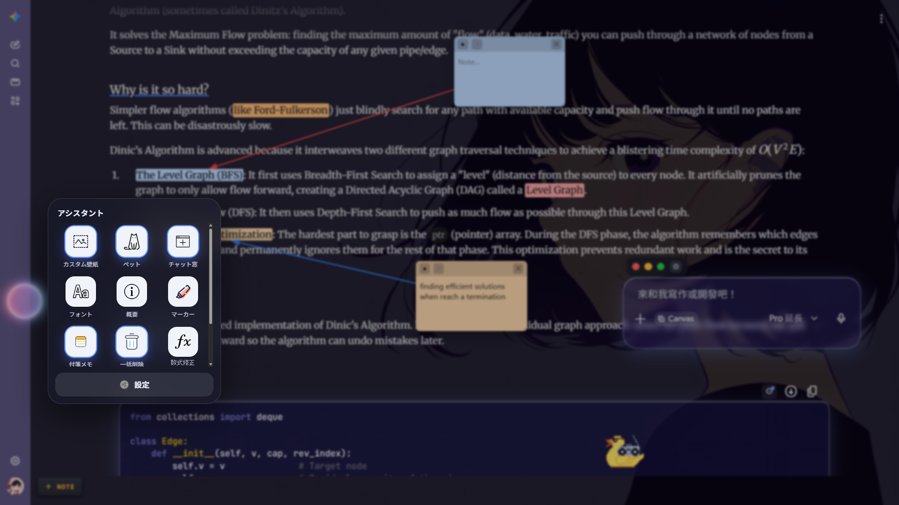

<sub><i>自訂桌布、毛玻璃介面、以箭頭連接的便利貼、彩色螢光標註、套用主題的程式碼區塊，還有一隻 DJ 小鴨 —— 全部同時運作於同一個頁面。</i></sub>

</div>

---

## 👋 為什麼做這個？

Gemini 很棒，但頁面是「固定」的 —— 一種背景、一種外觀，也沒有地方留下你自己的註記。Gemini Wallpaper 會注入 `gemini.google.com`，把頁面交還給你：**你的**桌布、**你的**字型、**你的**玻璃質感，再加上一整套 Gemini 沒有內建的閱讀與對話管理工具。

一切皆為選用（opt-in），所有設定都保存在 `chrome.storage.local`，而且**任何資料都不會離開你的瀏覽器**。幾乎所有工具都收在一顆浮動的**助手球（Assistant orb）**裡，所以頁面在你需要之前都保持乾淨。

<div align="center">
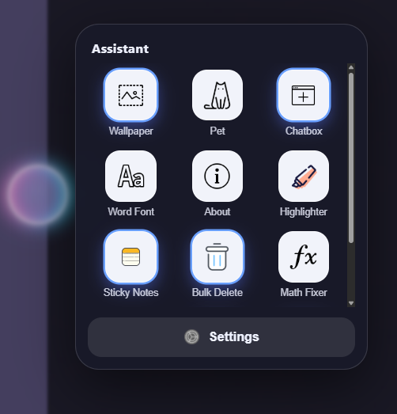
<br><sub><i>點一下小球 → 所有功能，一個網格搞定。</i></sub>
</div>

---

## ✨ 功能

### 🖼️ 背景與外觀

把任何圖片（JPG/PNG/WebP）設為 Gemini 的背景 —— 支援**拖放**、**檔案選擇**，或直接在頁面上**貼上（Ctrl+V）**。接著微調暗化**遮罩（dim）**、背景**模糊（blur）**與**亮度（brightness）**，讓文字在任何圖片上都清晰易讀；還能把側邊欄和輸入框**霧化**成真實玻璃質感，並自訂色調與透明度。

<div align="center">
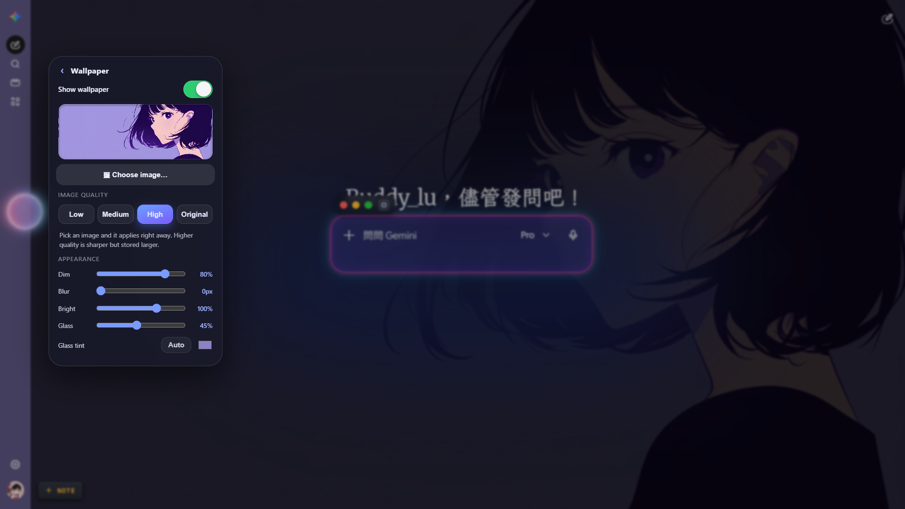
</div>

- **🌅 自訂桌布** —— 任何圖片，會縮放後存於本機，讓頁面保持流暢。
- **🎚️ 暗化 · 模糊 · 亮度** —— 在複雜圖案上也能調到最佳可讀性。
- **🧊 玻璃材質** —— 霧化側邊欄與輸入框，自訂色調＋透明度（`Auto` 會取樣桌布配色）。
- **⚡ 即時且持久** —— 每項變更立即套用、重啟後保留，並在 Gemini 的 SPA 重新繪製時自動重新套用。

#### 🔤 自訂字型

分別為**拉丁文**與**繁體中文**替換介面字型 —— 拉丁文優先，中文字則由中文字型補上。

<div align="center">
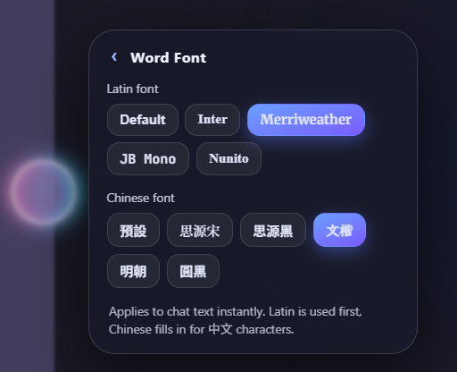
</div>

---

### 📖 閱讀與標註

在任何回覆中拖曳選取文字，用多種顏色的**螢光筆**或**底線**標記，或在段落上釘一張浮動**便利貼** —— 並以一條繪製的箭頭連向該段文字。標記與便利貼會**依對話分別保存**，並在捲動、切換頁面與重新載入後還原。

<div align="center">
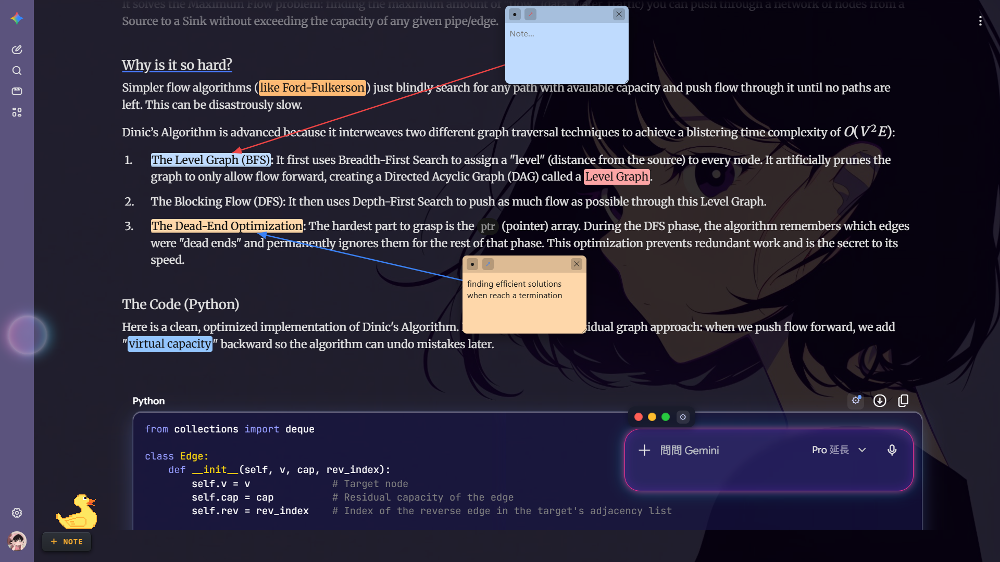
</div>

<table>
<tr>
<td width="50%" align="center">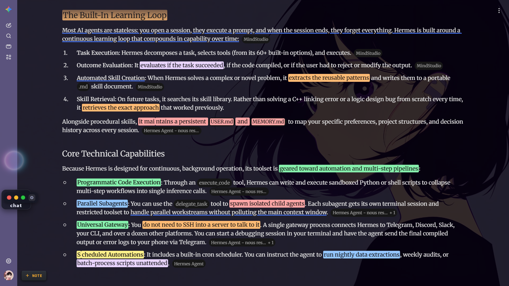<br><sub><b>🖍️ 螢光與底線</b> —— 多種顏色，依對話保存。</sub></td>
<td width="50%" align="center">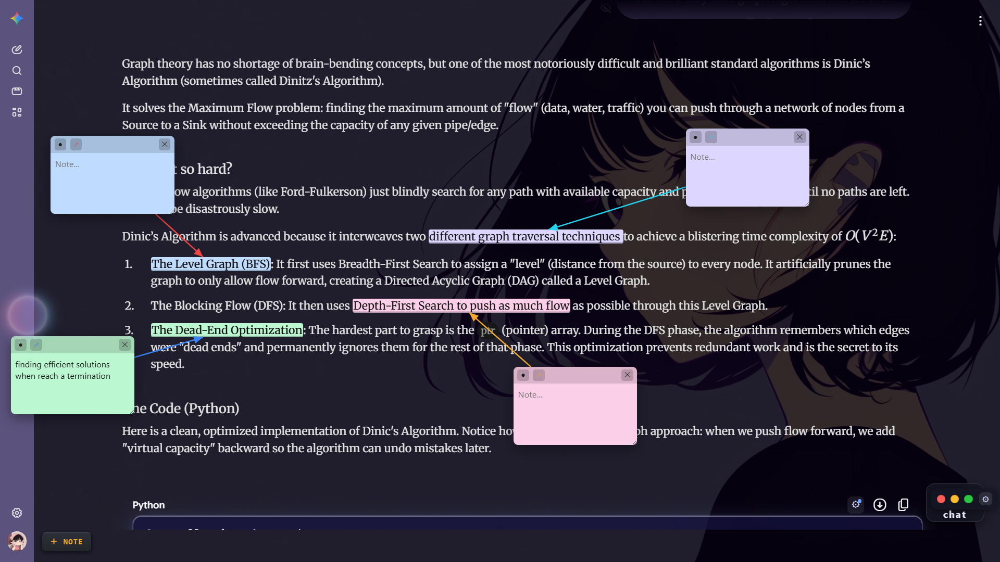<br><sub><b>📝 連結便利貼</b> —— 可拖曳、綁定於某段文字。</sub></td>
</tr>
</table>

#### ∑ 數學修復

當 Gemini 印出**原始 LaTeX** 而不是渲染結果時，每一條壞掉的公式都會出現一個 **Fix** 按鈕，用 **KaTeX** 就地渲染（本機內建，可離線運作）。同時支援區塊 `$$…$$` 與行內 `$…$`，並且不會動到一般文字與貨幣寫法（例如 `$5`）。

<table>
<tr>
<td width="50%" align="center"><b>之前 —— 原始 LaTeX</b></td>
<td width="50%" align="center"><b>之後 —— 一鍵搞定</b></td>
</tr>
<tr>
<td>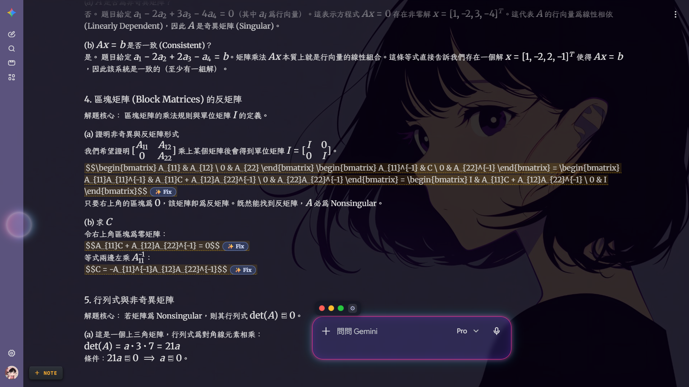</td>
<td>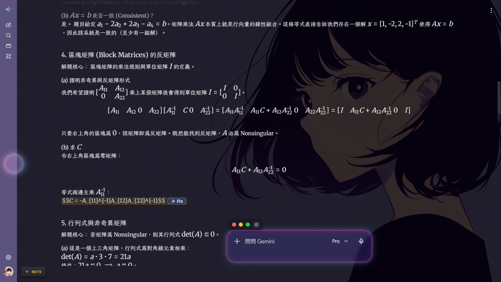</td>
</tr>
</table>

#### 🎨 程式碼區塊樣式

從 ⚙ 面板為每個程式碼區塊設定專屬外觀：邊框樣式（**無／邊框／光澤／合成波 synthwave**）、等寬字型、字級、行號、色調＋透明度、背景模糊與圓角。可只套用於**單一區塊**或**全部套用** —— 即使 Gemini 重新繪製，各區塊的樣式也會重新附著。你也可以在助手的**程式碼主題**卡片裡設定全域預設值（以及總開關）。

<table>
<tr>
<td width="62%" align="center">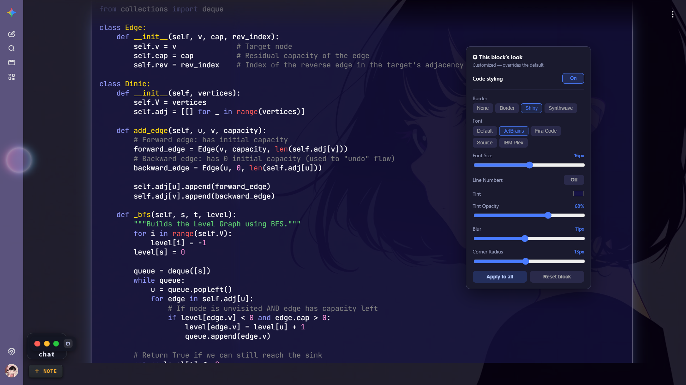<br><sub>套用主題的區塊，即時疊在你的桌布上。</sub></td>
<td width="38%" align="center">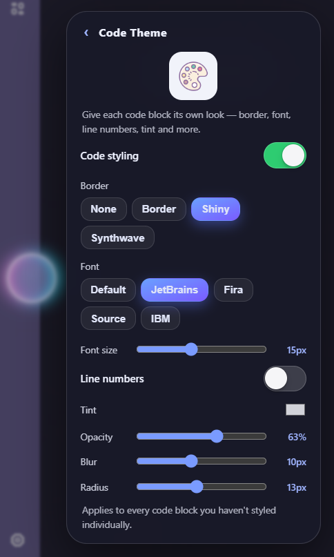<br><sub>單一區塊的 ⚙ 樣式面板。</sub></td>
</tr>
</table>

---

### 💬 對話管理

- **👁️ 隱藏對話紀錄** —— 把任何一組問答折疊成一條細長的摘要列，並附上單則的眼睛切換鈕。已隱藏的對話會依對話分別記住，讓冗長的討論串保持好瀏覽。
- **🗑️ 側邊欄批次刪除** —— 為側邊欄每則對話加上核取方塊；選取多則後，浮動列一次全部清除。它走的是 Gemini 自己的刪除流程（不使用私有 API），而且選取狀態能在側邊欄的虛擬捲動下維持。

<div align="center">
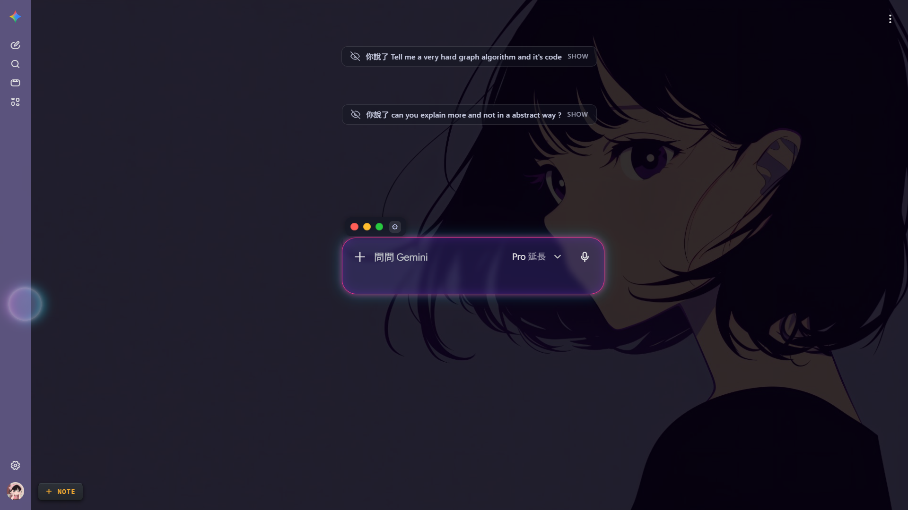
</div>

---

### 🐾 樂趣與氛圍

- **🧭 助手啟動器** —— 一顆浮動、仿 iOS AssistiveTouch 風格的**玻璃球**，會吸附到最近的螢幕邊緣，閒置時輕輕呼吸，點開後彈出功能網格。
- **⏳ 思考小夥伴** —— Gemini 生成回答時，你的輸入框旁會出現一隻循環播放的動漫吉祥物，答案送達後自動消失。
- **🪟 視窗化聊天框** —— 把輸入框變成可拖曳／縮放的視窗，附帶 macOS 風格的紅綠燈按鈕（最小化 · 還原 · 最大化）與專屬外觀面板。
- **🦆 桌面寵物** —— 一隻小夥伴在頁面上走來走去。挑一隻你喜歡的：

<table>
<tr>
<td align="center">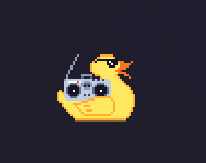<br><sub><b>鴨</b></sub></td>
<td align="center">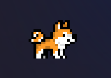<br><sub><b>狗</b></sub></td>
<td align="center">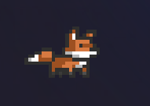<br><sub><b>狐狸</b></sub></td>
</tr>
</table>

<sub>寵物圖素取自 <a href="https://github.com/tonybaloney/vscode-pets">vscode-pets</a> 專案。</sub>

---

### ⚙️ 單一控制中心

語言（8 種語系）、圖片畫質、玻璃色調、程式碼預設、GitHub，以及一個需點兩下確認的重設 —— 全部收在一個 bento（便當格）設定視圖裡。

<div align="center">
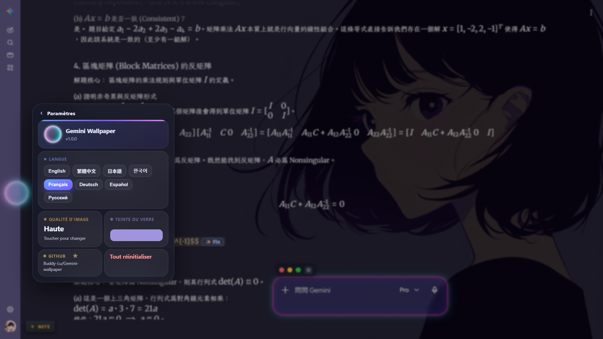
</div>

### 🛡️ 幕後原理

- **情境守衛（Context guard）** —— 一支最先載入的小腳本，避免其他模組在你重新載入未封裝擴充功能後拋出 *「Extension context invalidated」*；在你重新整理分頁前，storage 呼叫會安靜地無作用。
- **零相依、零連網** —— 沒有建置步驟、沒有追蹤、沒有外部連線（KaTeX 與其字型皆內建於本機）。設定只存在於 `chrome.storage.local`。

---

## 📥 安裝

尚未上架 Web Store —— 以「未封裝」方式載入，大約一分鐘搞定：

1. **下載**最新的 **[release ZIP](../../releases/latest)** 並解壓縮（會得到一個 `gemini-wallpaper` 資料夾）。*或者*直接 clone 本專案。
2. 打開 **`chrome://extensions/`**（Edge：`edge://extensions/`）。
3. 開啟右上角的**開發人員模式**。
4. 點**載入未封裝項目**，選擇含有 **`manifest.json`** 的資料夾。
5. 從拼圖選單把 **Gemini Wallpaper** 釘選起來。
6. 開啟 **[gemini.google.com](https://gemini.google.com)** —— 助手球會出現，工具列彈出視窗則提供桌布控制項。

> 修改程式碼後，請在 `chrome://extensions/` 按**重新載入**，再重新整理 Gemini 分頁。

---

## 🚀 快速上手

- **設定桌布** —— 工具列圖示 → 拖放或選擇圖片 → 調整暗化／模糊／亮度。或直接在頁面任意處**貼上圖片**。
- **開啟每項功能** —— 點浮動的**助手球**，挑一個圖示。
- **標註** —— 選取文字 → 選一個螢光顏色，或新增一張連結便利貼。
- **修復數學** —— 看到被標記的公式 → 點 **Fix**。
- **整理對話** —— 用**隱藏對話**的眼睛折疊問答，或啟用**批次刪除**清掉舊對話。

---

## 🗂️ 專案結構

```
Gemini-wallpaper/
├── manifest.json          # MV3 manifest（必須留在根目錄）
├── src/
│   ├── content/           # 注入的內容腳本（每個功能一個 IIFE）
│   │   ├── guard.js           # 過期情境守衛（最先載入）
│   │   ├── content.js         # 桌布 · 字型 · 玻璃
│   │   ├── assistant.js       # 浮動小球＋功能選單
│   │   ├── annotations.js     # 螢光／底線
│   │   ├── linked-notes.js    # 依對話的便利貼
│   │   ├── math.js            # LaTeX 偵測＋Fix（KaTeX）
│   │   ├── code-style.js      # 逐區塊程式碼主題
│   │   ├── hide-chat.js       # 折疊問答
│   │   ├── bulk-delete.js     # 側邊欄多選刪除
│   │   ├── chatbox-drag.js    # 視窗化輸入框
│   │   ├── pet.js             # 走動的桌面寵物
│   │   └── thinking-buddy.js  # 載入吉祥物
│   ├── popup/             # 工具列彈出視窗（popup.html + popup.js）
│   └── styles/            # content.css
├── vendor/
│   ├── katex/             # KaTeX 函式庫＋woff2 字型（本機、離線）
│   └── katex-fonts.js     # 字型載入接合
├── assets/                # 工具列與助手圖示、內建字型
└── docs/img/              # README 截圖
```

每個內容腳本都是自成一體的 IIFE。它們彼此從不互相呼叫 —— 全部透過 `chrome.storage.local` 協調：彈出視窗寫入一個鍵，對應的模組就即時接手處理。

---

## 🩹 疑難排解

- **某個功能不見了？** Gemini 的 DOM（混淆過的類別名稱）會在不同版本間變動。先重新整理分頁；各模組已使用寬鬆、耐用的選擇器，但 Google 仍可能搬動元素。
- **主控台出現「Extension context invalidated」？** 你在 Gemini 分頁開著時重新載入了未封裝擴充功能 —— 重新整理分頁即可。在那之前，`guard.js` 會避免它出錯。
- **數學沒渲染？** 只有 Gemini 以原始 LaTeX 印出的公式才會有 **Fix** 按鈕；已經渲染好的數學會維持原樣。

### ⚠️ 已知限制

- **助手球有時會變成點不到。** 偶爾那顆浮動球會對點擊沒反應 —— 只要**重新整理頁面**它就會恢復。
- **元素會有輕微位移。** 由於功能會操作 Gemini 的 DOM，部分元素可能偏移幾個像素，可能影響美觀。
- **聊天框在全螢幕下無法填滿整個頁面。** 在最大化模式下，視窗化聊天框目前還無法延展到頁面文字的完整寬度。
- **其他小工具可能互相干擾。** 同樣會尋找聊天輸入框的擴充功能可能產生衝突 —— 例如一個 *FastFolder* 風格的 UI 在尋找聊天框時，可能會讓它自己的面板跟著移動。
- **長時間使用後會卡頓。** 由於特效較多，連續使用約 **30–40 分鐘**後，資源占用會逐漸累積而導致卡頓。目前尚未解決，之後會持續改進；但就像助手球一樣，只要**重新整理頁面**即可暫時解決。
- **大多為 vibe coding。** 大部分程式碼是透過 AI 助手（Claude Code）以 vibe coding 的方式產生，而非逐行手寫與審查 —— 難免有粗糙之處，歡迎 PR。

---

## 📄 授權

**MIT** —— 你想怎麼用都行。KaTeX 以其自身的 MIT 授權內建，寵物圖素則來自 [vscode-pets](https://github.com/tonybaloney/vscode-pets) 專案。

<div align="center">
<br>
<sub>與 Google 無任何隸屬關係。「Gemini」為 Google LLC 的商標。</sub>
</div>
